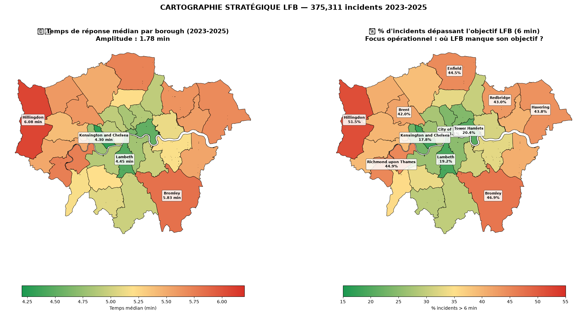

# 🔥 Pyrefighter V2 — London Fire Brigade Response Time Analysis

> **Analyse stratégique de 1,8 million d'interventions de la London Fire Brigade sur 17 ans (2009-2026) pour identifier les zones prioritaires d'investissement opérationnel.**



---

## 🎯 Le pitch en 30 secondes

**Contexte** : la London Fire Brigade (LFB) vise 6 min pour arriver sur site. Elle rate cet objectif sur 40 000+ incidents/an. Où intervenir en priorité ?

**Approche** : consolidation de 7 fichiers open data (LFB Incidents + Mobilisation 2009-2026, ~1 Go) en un dataset unique, enrichissement multi-sources (météo, démographie, calendrier UK), feature engineering (40 variables) et modélisation LightGBM.

**Pivot stratégique** ⚠️ : après avoir constaté qu'un simulateur temps réel donnerait des intervalles trop larges (~3 min) pour un usage en centre d'appel, le projet a pivoté vers un **outil d'analyse territoriale** destiné aux décideurs LFB — plus honnête, plus utile.

**Livrable** : un dashboard analytique + 5 recommandations chiffrées pour la LFB.

---

## 📊 5 découvertes majeures

### 1. Inégalité territoriale marquée
- **Amplitude : 1,82 min** entre Kensington & Chelsea (4,23 min) et Hillingdon (6,05 min)
- Pattern radial : cœur inner London performant, périphérie critique
- **10 boroughs sur 33** dépassent 40% d'incidents > 6 min

### 2. Transformation du rôle de la LFB (2010-2025)
- Part des incendies : 23,4% → **15,0%** (-36%) grâce à la prévention
- Part des Special Services : 24,0% → **38,0%** (+58%)

### 3. Détérioration structurelle post-COVID
- Médiane 2020 : 4,77 min (creux du lockdown)
- Médiane 2025 : 5,17 min (**+8,4% en 5 ans, sans inflexion**)

### 4. Impact quantifié des fermetures 2014
- Médiane 2013 : 4,83 min → 2015 : 5,17 min (**+7% en 2 ans**)

### 5. Volume opérationnel raté
- **40 136 incidents/an** hors objectif dans le top 10 des boroughs prioritaires
- Environ **110 dépassements par jour**

📄 Détail complet : reports/EXECUTIVE_SUMMARY.md

---

```
pyrefighter-v2/
├── data/
│   ├── raw/                # 7 fichiers bruts (gitignored)
│   └── processed/          # Silver v2 Parquet (1.8M lignes, 75 Mo)
├── notebooks/
│   ├── 01_data_exploration.ipynb
│   ├── 02_feature_engineering.ipynb
│   ├── 03_baseline_model.ipynb
│   └── 04_strategic_analysis.ipynb
├── reports/                # Graphes + livrables exécutifs
├── requirements.txt
└── README.md
```

---

## 🛠️ Stack technique

- **Data** : Pandas, PyArrow (Parquet), OpenPyxl
- **ML** : LightGBM (régression + quantile), Scikit-learn
- **Enrichissement** : Open-Meteo API, London Datastore, lib `holidays`
- **Visualisation** : Matplotlib, Seaborn, GeoPandas

---

## 📈 Résultats de modélisation

| Modèle | MAE | RMSE | R² |
|--------|-----|------|-----|
| Baseline naïve (médiane) | 1,58 min | 2,22 min | -0,03 |
| LightGBM régression | 1,30 min | 1,96 min | +0,20 |
| Quantile Regression P10-P90 | Couverture 78,9% | Largeur 3,90 min | — |

**Le modèle prédictif ponctuel** a été jugé **non exploitable en usage opérationnel temps réel** (intervalle trop large pour un centre d'appel), d'où le **pivot vers l'analyse stratégique**.

---

## 💡 Ce que ce projet démontre

- ✅ Consolidation de données hétérogènes multi-sources (17 ans, ~1 Go)
- ✅ Détection et correction de bugs subtils (mismatch clé 2015 → +82k lignes récupérées)
- ✅ Feature engineering rigoureux (40 variables, anti-leakage temporel)
- ✅ Modélisation LightGBM + Quantile Regression
- ✅ **Capacité à pivoter** face à une limitation méthodologique
- ✅ Dashboard analytique exécutif avec recommandations chiffrées

---

## 📜 Version originale (2022)

Ce projet est la refonte modernisée de : [Pyrefighter/Pyrefighter (V1)](https://github.com/Pyrefighter/Pyrefighter).

---

## 👤 Auteur

**Guillaume Blais**
